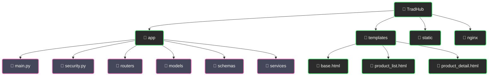

<div align="center">

# 💼 TradHub - Инновационный маркетплейс цифровых товаров и услуг

<p align="center">
  <a href="https://fastapi.tiangolo.com/"></a>
  <a href="https://www.python.org/"></a>
  <a href="https://www.postgresql.org/"></a>
</p>

<p align="center">
  <a href="#"></a>
  <a href="#"></a>
  <a href="#"></a>
</p>

<p align="center">
  <a href="#"></a>
  <a href="#"></a>
  <a href="#"></a>
</p>

</div>

<!-- ⚡ ДЕКОРАТИВНЫЙ РАЗДЕЛИТЕЛЬ ⚡ -->
<div align="center">
  
</div>

## 🛒 Универсальная площадка для торговли цифровыми товарами и услугами

## 📋 О проекте

<div align="center">

<h3><i>Современная экосистема для безопасных цифровых сделок</i></h3>

</div>

<div align="center">

TradHub - это высокопроизводительная платформа для торговли цифровыми товарами и услугами, разработанная с использованием передовых технологий. Построенная на FastAPI и PostgreSQL, платформа обеспечивает быструю работу, масштабируемость и надежную защиту данных. Интегрированная система безопасных платежей, чат между пользователями и подробная аналитика делают TradHub идеальным решением как для частных продавцов, так и для бизнеса.

</div>

<!-- 🎯 ДЕКОРАТИВНЫЙ РАЗДЕЛИТЕЛЬ 🎯 -->
<div align="center">
  
</div>

### ✨ Основные возможности

<div align="center">

<table style="min-width: 300px; width: auto; max-width: 100%; overflow-x: auto; display: block;">
  <tr>
    <th align="center">🔥 Функция</th>
    <th align="center">📝 Описание</th>
  </tr>
  <tr>
    <td align="center"><b>🔐 Безопасная аутентификация</b></td>
    <td>Многофакторная аутентификация и защита сессий пользователей</td>
  </tr>
  <tr>
    <td align="center"><b>💳 Система платежей</b></td>
    <td>Интеграция с платежными системами и безопасное проведение транзакций</td>
  </tr>
  <tr>
    <td align="center"><b>💬 Встроенный мессенджер</b></td>
    <td>Мгновенный обмен сообщениями между продавцами и покупателями</td>
  </tr>
  <tr>
    <td align="center"><b>📊 Расширенная аналитика</b></td>
    <td>Детальные отчеты о продажах, поведении пользователей и тенденциях рынка</td>
  </tr>
  <tr>
    <td align="center"><b>⭐ Система рейтингов</b></td>
    <td>Оценка и отзывы для продавцов и товаров для построения доверительных отношений</td>
  </tr>
  <tr>
    <td align="center"><b>🔍 Умный поиск</b></td>
    <td>Расширенные фильтры и категории для быстрого поиска нужных товаров</td>
  </tr>
</table>

</div>

<!-- 🔥 ДЕКОРАТИВНЫЙ РАЗДЕЛИТЕЛЬ 🔥 -->
<div align="center">
  
</div>

## 🚀 Технологический стек

<div align="center">

<details open>
<summary><b>⚡ Используемые технологии</b></summary>
<br>

<div style="background-color: #2b2b2b; color: #f8f8f2; padding: 15px; border-radius: 10px;">

| 💻 Технология | 📝 Описание |
|---------------|-------------|
| <span style="color: #ff79c6;">FastAPI</span> | Высокопроизводительный фреймворк для создания API на Python |
| <span style="color: #8be9fd;">PostgreSQL</span> | Надежная реляционная база данных |
| <span style="color: #bd93f9;">Redis</span> | Хранилище данных в памяти для кеширования и очередей сообщений |
| <span style="color: #50fa7b;">Celery</span> | Асинхронная очередь задач для фоновых операций |
| <span style="color: #ffb86c;">SQLAlchemy</span> | ORM для удобной работы с базой данных |
| <span style="color: #ff5555;">Docker</span> | Контейнеризация для удобного развертывания |
| <span style="color: #f1fa8c;">Jinja2</span> | Шаблонизатор для создания динамических страниц |
| <span style="color: #8be9fd;">Nginx</span> | Высокопроизводительный веб-сервер и прокси |

</div>

</details>

</div>

<!-- 🎮 ДЕКОРАТИВНЫЙ РАЗДЕЛИТЕЛЬ 🎮 -->
<div align="center">
  
</div>

## 🎯 Для кого создан TradHub

<div align="center">

<kbd>


</kbd>

<br><br>

<table style="min-width: 300px; width: auto; max-width: 100%; overflow-x: auto; display: block;">
  <tr>
    <th align="center">👥 Пользователи</th>
    <th align="center">💎 Преимущества</th>
  </tr>
  <tr>
    <td align="center">🎨 Цифровые художники</td>
    <td>Продажа цифрового искусства, иллюстраций и 3D-моделей</td>
  </tr>
  <tr>
    <td align="center">👨‍💻 Разработчики</td>
    <td>Продажа ПО, плагинов, шаблонов и исходного кода</td>
  </tr>
  <tr>
    <td align="center">📚 Авторы</td>
    <td>Распространение электронных книг, курсов и учебных материалов</td>
  </tr>
  <tr>
    <td align="center">🔧 Сервисные компании</td>
    <td>Предложение консультаций, настройки и технической поддержки</td>
  </tr>
</table>

</div>

<!-- 💎 ДЕКОРАТИВНЫЙ РАЗДЕЛИТЕЛЬ 💎 -->
<div align="center">
  
</div>

## ⚙️ Установка и запуск

### Системные требования

<div align="center">

<table style="min-width: 300px; width: auto; max-width: 100%; overflow-x: auto; display: block;">
  <tr>
    <th align="center">🖥️ Компонент</th>
    <th align="center">⚙️ Минимум</th>
    <th align="center">🚀 Рекомендуется</th>
  </tr>
  <tr>
    <td align="center">Docker</td>
    <td align="center">20.10+</td>
    <td align="center">23.0+</td>
  </tr>
  <tr>
    <td align="center">Docker Compose</td>
    <td align="center">2.0+</td>
    <td align="center">2.14+</td>
  </tr>
  <tr>
    <td align="center">Оперативная память</td>
    <td align="center">4 ГБ</td>
    <td align="center">8 ГБ</td>
  </tr>
  <tr>
    <td align="center">Дисковое пространство</td>
    <td align="center">10 ГБ</td>
    <td align="center">20 ГБ</td>
  </tr>
</table>

</div>

### Пошаговая установка

<div align="center">

<table style="min-width: 300px; width: auto; max-width: 100%; overflow-x: auto; display: block;">
  <tr>
    <th colspan="2" align="center">🚀 Установка проекта</th>
  </tr>
  <tr>
    <td align="center" width="70"><b>1️⃣</b></td>
    <td>
      <b>Клонируйте репозиторий</b><br>
      <code>git clone https://github.com/yourusername/tradehub.git</code><br>
      <code>cd tradehub</code>
    </td>
  </tr>
  <tr>
    <td align="center"><b>2️⃣</b></td>
    <td>
      <b>Создайте файл .env из примера</b><br>
      <code>cp .env.example .env</code><br>
      <i>Отредактируйте .env файл, указав нужные настройки</i>
    </td>
  </tr>
  <tr>
    <td align="center"><b>3️⃣</b></td>
    <td>
      <b>Запустите с помощью Docker Compose</b><br>
      <code>docker-compose up -d</code>
    </td>
  </tr>
  <tr>
    <td align="center"><b>4️⃣</b></td>
    <td>
      <b>Создайте администратора</b><br>
      <code>docker-compose exec web python create_admin.py</code>
    </td>
  </tr>
  <tr>
    <td align="center"><b>5️⃣</b></td>
    <td>
      <b>Откройте сайт</b><br>
      Перейдите по адресу <code>http://localhost:80</code>
    </td>
  </tr>
</table>

</div>

### Быстрый запуск (Windows)

```powershell
# Запуск проекта и всех сервисов
.\start_tradehub.ps1

# Запуск без Docker
.\start_tradehub_no_docker.ps1

# Просмотр логов
.\view_service_logs.ps1
```

<!-- 🛡️ ДЕКОРАТИВНЫЙ РАЗДЕЛИТЕЛЬ 🛡️ -->
<div align="center">
  
</div>

## 🔧 Разработка

### Структура проекта

<div align="center">



</div>

### Управление проектом

<div align="center">

<table style="min-width: 300px; width: auto; max-width: 100%; overflow-x: auto; display: block;">
  <tr>
    <th align="center">🛠️ Действие</th>
    <th align="center">💻 Команда</th>
  </tr>
  <tr>
    <td align="center">Запуск в режиме разработки</td>
    <td><code>docker-compose up</code></td>
  </tr>
  <tr>
    <td align="center">Перезапуск сервисов</td>
    <td><code>docker-compose restart</code></td>
  </tr>
  <tr>
    <td align="center">Просмотр логов</td>
    <td><code>docker-compose logs -f</code></td>
  </tr>
  <tr>
    <td align="center">Просмотр только ошибок</td>
    <td><code>.\errors_only.ps1</code></td>
  </tr>
  <tr>
    <td align="center">Настройка автозапуска</td>
    <td><code>.\setup_autostart.ps1</code></td>
  </tr>
</table>

</div>

<!-- 🏆 ДЕКОРАТИВНЫЙ РАЗДЕЛИТЕЛЬ 🏆 -->
<div align="center">
  
</div>

## 📊 Производительность и масштабирование

<div align="center">

<p>TradHub разработан с учетом высоких нагрузок и оптимизирован для обработки большого количества одновременных запросов.</p>

<ul align="left">
  <li>✅ Асинхронная обработка запросов с FastAPI</li>
  <li>✅ Celery для выполнения фоновых задач</li>
  <li>✅ Redis для кеширования и обмена сообщениями</li>
  <li>✅ Контейнеризация с Docker для горизонтального масштабирования</li>
  <li>✅ Оптимизированные SQL-запросы и индексирование базы данных</li>
</ul>

</div>

## 🔒 Безопасность

<div align="center">

<p>Безопасность TradHub обеспечивается на всех уровнях системы.</p>

<ul align="left">
  <li>🔐 Хеширование паролей с использованием bcrypt</li>
  <li>🔐 JSON Web Tokens (JWT) для аутентификации</li>
  <li>🔐 Многофакторная аутентификация</li>
  <li>🔐 Защита от SQL-инъекций через SQLAlchemy</li>
  <li>🔐 Защита от CSRF-атак</li>
  <li>🔐 Проверка входящих данных с Pydantic</li>
</ul>

</div>

<!-- 🌟 ДЕКОРАТИВНЫЙ РАЗДЕЛИТЕЛЬ 🌟 -->
<div align="center">
  
</div>

## 📧 Контакты

<div align="center">

<table style="min-width: 300px; width: auto; max-width: 100%; overflow-x: auto; display: block;">
  <tr>
    <th align="center">📱 Контакт</th>
    <th align="center">🔗 Ссылка</th>
  </tr>
  <tr>
    <td align="center">📧 Email</td>
    <td align="center"><a href="mailto:support@tradehub.io">support@tradehub.io</a></td>
  </tr>
  <tr>
    <td align="center">💬 Telegram</td>
    <td align="center"><a href="https://t.me/tradehub_support">@tradehub_support</a></td>
  </tr>
  <tr>
    <td align="center">🌐 GitHub</td>
    <td align="center"><a href="https://github.com/yourusername/tradehub">TradHub на GitHub</a></td>
  </tr>
</table>

</div>

<!-- 🌅 ДЕКОРАТИВНЫЙ РАЗДЕЛИТЕЛЬ 🌅 -->
<div align="center">
  
</div>

## 🤝 Поддержка проекта

<div align="center">

<kbd>
<a href="https://github.com/yourusername/tradehub">
  
</a>
<a href="https://github.com/yourusername/tradehub/issues/new?labels=bug">
  
</a>
<a href="https://github.com/yourusername/tradehub/issues/new?labels=enhancement">
  
</a>
</kbd>

</div>

---

<div align="center">
  
<h1>💼 TradHub - Инновационный маркетплейс для цифровой экономики! 💼</h1>


</div> 